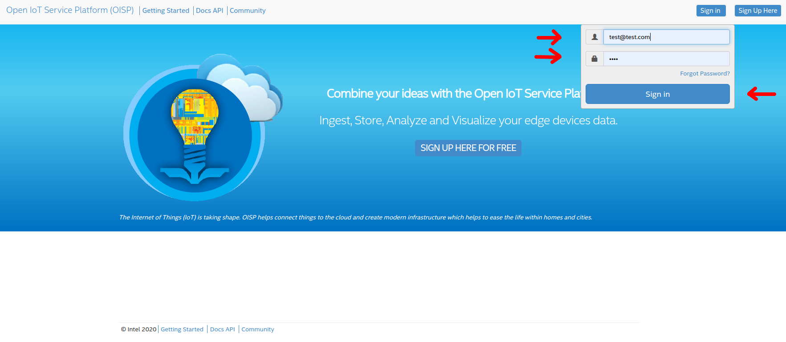
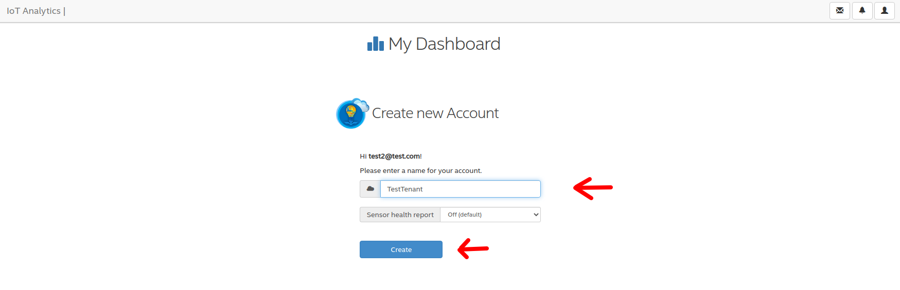
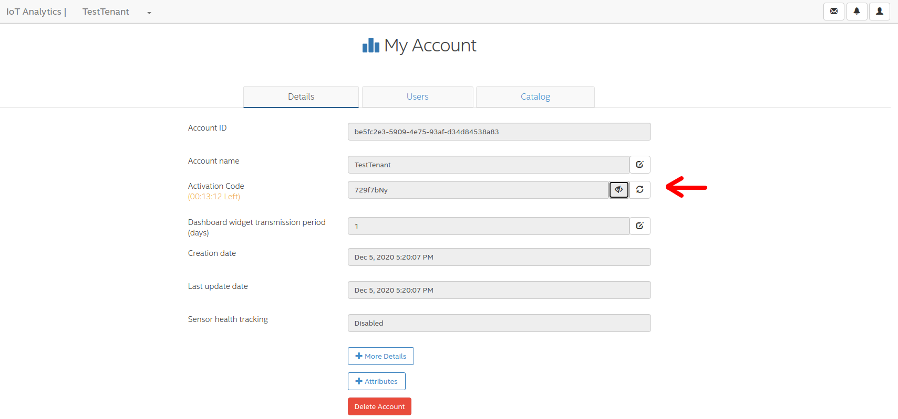
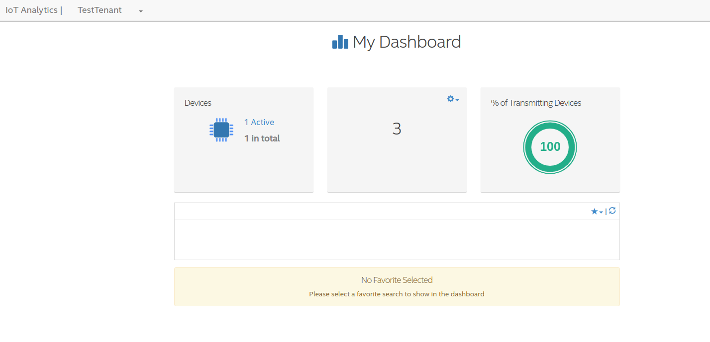
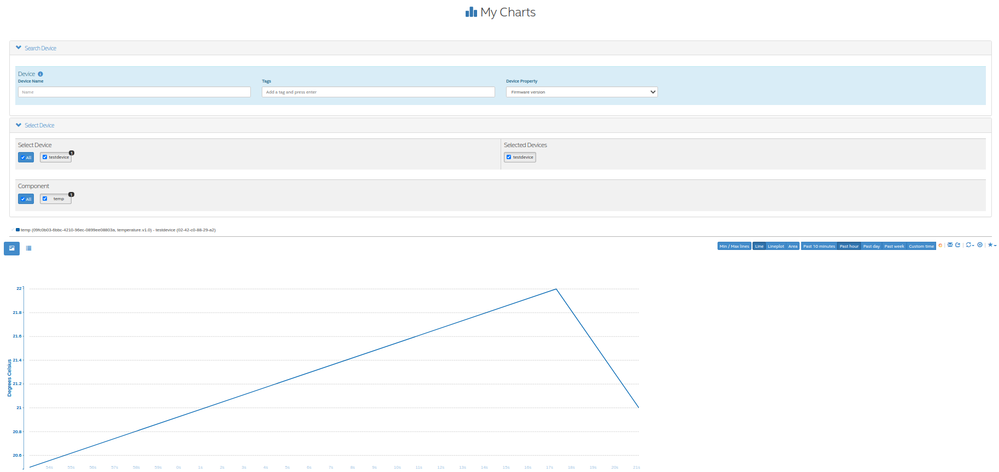

Getting Started
===============

Open IoT Software platform (OISP) is an `open source <https://github.com/Open-IoT-Service-Platform/platform-launcher/>`_ framework for IoT services that runs on Kubernetes.
OISP provides:

* IoT Device onboarding

* Role based access management for users with Keycloak

* Metrics collection in a Cassandra cluster

* Sending Control Commands back to Devices

* Multi-Tenant isolation

* Rule Engine to trigger Alerts based on metrics conditions

* Apache Flink/Apacahe Beam based service management to enable at-least-once and exactly-once guarantees

* Alerts which can be sent by email, device commands or http triggers

* REST API to manage different Tenants, Users, Devices, Rules, Alerts

* MQTT/Websockets/REST services to connect Devices

* High availability of services

* Scalable design to support several hunderts to many thousand devices

* Kubernetes only design - can be deployed on every Kubernetes cluster

..
          Start by cloning the repo **and checking out the develop branch**. This documentation assumes you are running an Ubuntu system (preferably 18.04 LTS), but other Linux distributions should also work with minor modifications.

.. note:: Most of the functionality described in this documentation is packed into the ``Makefile`` in the project root. Run ``make help`` for a list of available commands with descriptions.

.. _build-local-platform:

Build local platform based on git tags
--------------------------------------

A local platform is mainly meant for functional testing, it is therefore not providing any high availability and should not be used for production deployments.
It can be built and deployed independently of whether you have dockerhub access to OISP repository.
In the following, we describe the build, deploy, and test of ``v2.0.0-beta.1`` version on Ubuntu 18.04 LTS

.. code-block:: bash

  sudo apt install net-tools
  git clone https://github.com/Open-IoT-Service-Platform/platform-launcher.git

  cd platform-launcher/
  git checkout v2.0.0-beta.1
  cd util/
  sudo bash ./setup-ubuntu18.04.sh
  cd ..
  git submodule update --init --recursive
  export NODOCKERLOGIN=true

  sudo -E DEBUG=true  DOCKER_TAG=v2.0.0-beta.1 make build
  sudo -E DEBUG=true make DOCKER_TAG=v2.0.0-beta.1 import-images
  sudo -E DEBUG=true make DOCKER_TAG=v2.0.0-beta.1 deploy-oisp-test
  sudo make test

.. _access-and-login:

Access and login to local platform
----------------------------------

To access and test the local version, we recommend to use ``kubefwd`` a tool that forwards all Kubernetes services of a namespace to the local system.

.. code-block:: bash

  sudo KUBECONFIG=~/.kube/config kubefwd -n oisp svc

After ``kubefwd`` forwarded all services, the platform can be accessed with a browser and the url ``http://frontend:4001``.
However, at this point it time, there is no valid user in the database. So you need to create a test user.

To login and create your first tenant (account), you have to create an initial admin user. To create the first user, there is a tool in the frontend container:

.. code-block:: bash

  # find the name of the frontend pod, e.g. by
  FRONTEND_POD=$(kubectl -n oisp get pods| grep frontend| cut -f 1 -d " ")
  # execute initial creation command in frontend pod
  kubectl -n oisp exec -i $FRONTEND_POD -c frontend -- node /app/admin addUser test@test.com test

.. note:: The creation of a test user can be simplified by using a prepared make target, as described in Section :ref:`using-oisp`

Then login to the platform with the user:

Since the user is not assigned to a tenant (account), you will asked to define your own at your first login:

.. _onboard-your-first-device:

Onboard your first device
-------------------------

Now we are showing how to onboard a device to the framework. First, we need the OISP-Agent, which is the part which runs on the device. One agent is typcially
responsible for one device.
We assume that a local oisp system has been setup and ``kubefwd`` is used to forward the kubernetes services as described in Section :ref:`access-and-login`

First, checkout the repository:

.. code-block:: bash

  git clone https://github.com/Open-IoT-Service-Platform/oisp-iot-agent.git
  cd oisp-iot-agent
  npm install

Then configure the agent for your local OISP instance:

.. code-block:: bash

  cat << EOF > config/config.json
  {
    "data_directory": "./data",
    "listeners": {
      "rest_port": 8000,
      "udp_port": 41234,
      "tcp_port": 7070
    },
    "receivers": {
      "udp_port": 41235,
      "udp_address": "0.0.0.0"
    },
    "logger": {
      "level": "info",
      "path": "/tmp/",
      "max_size": 134217728
    },
    "default_connector": "rest+ws",
    "connector": {
      "rest": {
        "host": "frontend",
        "port": 4001,
        "protocol": "http",
        "strictSSL": false,
        "timeout": 30000,
        "proxy": {
          "host": false,
          "port": false
        }
      },
      "ws": {
        "host": "websocket-server",
        "port": 5000,
        "minRetryTime": 2500,
        "maxRetryTime": 600000,
        "testTimeout": 40000,
        "pingPongIntervalMs": 30000,
        "enablePingPong": true,
        "secure": false,
        "proxy": {
          "host": false,
          "port": false
        }
      },
      "mqtt": {
        "host": "mqtt-server",
        "port": 8883,
        "qos": 1,
        "retain": false,
        "secure": true,
        "strictSSL": false,
        "retries": 5
      }
    }
  }
  EOF

In order to verify whether the agent finds the local OISP service, execute the following command:

.. code-block:: bash

  ./oisp-admin.js test

If all was configured right, the output should look like

.. code-block:: bash

  info: Cloud Proxy created with Cloud Handler: rest
  info: Mqtt proxy found! Configuring MQTT for data sending.
  info: No credentials found for MQTT. Disable MQTT test
  info: Trying to connect to host with REST...
  info: Response:  {"kind":"healthcheck","isHealthy":true,"currentSetting":"local","name":"dashboard","build":"0.15.0","revision":"unknown","date":"2015-08-26T10:38:38.773Z","items":[]}
  info: Connected to frontend
  info: Environment: local
  info: Build: 0.15.0
  info: Trying to connect to WS server ...
  info: Connection to Web Socket Server successful
  info: Websocket connection closed. Reason: 1000 Normal connection closure

Then, define the device

.. code-block:: bash

  ./oisp-admin.js initialize
  ./oisp-admin.js set-device-name testdevice

To onboard the device to the platform, you need to get the activation code from the dashboard.
Click on the TestTenant you defined in Section :ref:`access-and-login` to see the tenant (account) details. Get the current activation code.
In case there is no valid code any longer (it is only valide for 1h) then refresh it.

Then, with the activation code, add your device to the platform:

.. code-block:: bash

  ./oisp-admin.js activate xxxxxxxx

.. note:: The activation code is randomly generated by the dashboard and is valid 1h to onboard devices to your tenant. Use the actual code from your platform and replace the ``xxxxxxxx`` in the command above

Now add a metric to your device:

.. code-block:: bash

  ./oisp-admin.js register temp temperature.v1.0

.. note:: The catalogue types temperature.v1.0 and humidity.v1.0 are default catalogue items and available on every platfrom. You can add your own metric and actuator type in the dashboard.

Finally, send some test metrics to the platform:

.. code-block:: bash

  ./oisp-admin.js observation temp 20.5
  ./oisp-admin.js observation temp 22.0
  ./oisp-admin.js observation temp 21.0

And watch it on the dashboard

and see the metrics on the charts:

For more details on the agent, please consult https://github.com/Open-IoT-Service-Platform/oisp-iot-agent.

Running OISP
--------------
OISP can be deployed on any Kubernetes cluster with a volume provisioner and an ingress controller. For development purposes, we recommend a local installation based on `k3s <https://k3s.io/>`_, as described in `Creating a lightweight local kubernetes cluster`_.

If you wish to deploy on an external cluster, make sure the following conditions are met:

1. Your host is configured to manage the cluster, meaning the default kubeconfig file is at ``~/.kube/config``.
2. Helm and kubectl are installed on the client and cluster.
3. The cluster has an Ingress controller and a volume provisioner configured.

Creating a lightweight local kubernetes cluster
~~~~~~~~~~~~~~~~~~~~~~~~~~~~~~~~~~~~~~~~~~~~~~~
Run the following commands from the repository root to create a local k3s cluster on an Ubuntu 18.04 host:

.. code-block:: bash

  cd util
  sudo apt install net-tools
  sudo bash setup-ubuntu-18.04.sh

.. note:: The script should also run on Ubuntu 16.04 LTS, but you might need to ``export PATH=$PATH:/snap/bin`` first. On other Linux distributions, please install the snap packages in the script manually, and run the script afterwards.

The cluster is created in two Docker containers, one for the master and one for the worker. If you like, you can modify the script to make k3s run on bare metal instead of Docker, but the containerized setup is recommended, to avoid issues like port clashes.

If you need to recreate the cluster, simply run ``make restart-cluster``.

.. warning:: Both scripts are going to replace your ``~/.kube/kubeconfig`` file!

Deployment
~~~~~~~~~~
If you have access to the OISP dockerhub repository, export your user credentials to your shell:

.. code-block:: bash

  export DOCKERUSER=[YOURUSERNAME]
  read -s DOCKERPASS # type your password and press enter
  export DOCKERPASS

Otherwise, you will have to build the images yourself as shown in Section :ref:`build-local-platform`.
You can specify a docker tag for the images being built. Run ``make help`` for more details. Afterwards, you have two options to get the images inside the cluster:

1. Run ``make import-images``, which also takes the ``DOCKER_TAG`` and ``DEBUG`` parameter, of which the later has to be set to ``true`` in order to run tests.
2. *OR* push the images to another repo, and adapt the ``imageCredentials`` section in ``kubernetes/values.yaml``. You will also need to export your credentials to your shell as described before.

There are couple of operators that OISP depends on. They can be installed buy running the script `util/deploy_operators.sh`.

Finally, adapt the ``kubernetes/values.yaml`` to fit your needs and run ``make deploy-oisp``.

.. note:: If you wish to run tests, or have a debugger container inside the cluster with useful tools, run ``make deploy-oisp-test``, which requires you to also build with ``make build DEBUG=true`` from the repository root.

.. hint:: You can watch the deployment process by running ``watch kubectl -n oisp get pods``, or programmatically wait until the system is up and running by using the command ``make wait-until-ready``.

Running end to end tests
~~~~~~~~~~~~~~~~~~~~~~~~
If you have deployed with ``make deploy-oisp-test``, you can run ``make test`` to make sure everything is working. The tests should take about 3-4 minutes to complete, *after the system is up and running*.

.. _using-oisp:

Using OISP
----------
You need a user account to interact with most of the API functionality. You can create a test user by running ``make add-test-user``. The username is ``user1@example.com`` and the password is simply ``password``.

.. _ExposeLocally:

Exposing OISP locally without ingresses
~~~~~~~~~~~~~~~~~~~~~~~~~~~~~~~~~~~~~~~
In a production environment, OISP should be exposed using Kubernetes ingresses. However, you might want to skip the configuration for local development purposes. It might also be useful to expose services which are not otherwise publicly accessible. You achieve this using `kubefwd <https://github.com/txn2/kubefwd>`_.

.. code-block:: bash

  sudo kubefwd services -n oisp --kubeconfig=/home/[YOUR_USERNAME]/.kube/config

Interacting with OISP
~~~~~~~~~~~~~~~~~~~~~

You can interact with OISP using the `REST API <https://streammyiot.com/ui/public/api.html>`_, or with our SDKs for `javascript <https://github.com/Open-IoT-Service-Platform/oisp-sdk-js>`_ and `python <https://github.com/Open-IoT-Service-Platform/oisp-sdk-python>`_.

.. warning:: Using the SDKs is the recommended way of interacting with the platform, however, they might not be always up to date with the latest features. Please feel welcome to open issues for any incompatibility problems between the API and the SDKs.

Deploying IoT-Agent with test sensor
~~~~~~~~~~~~~~~~~~~~~~~~~~~~~~~~~~~~
In :ref:`onboard-your-first-device` we have shown an example how to onboard a device directly on the host system.
But if you want to do the device onboarding containerized we provide a description below.

The folder ``./kubernetes/iot-agent`` contains an example on how to deploy the oisp-iot-agent
with Kubernetes. Once there is a running OISP instance, you can create a test user and deploy the agent by

1. Run ``make add-test-user`` to create a user in OISP.
2. Create or pull containers oisp-testsensor and oisp-iot-agent.
3. Import agent images ``make import-images-agent`` to import the images to k3s.
4. Login with the user to the OISP service, create an account and take the activation code from the account main page.
5. Copy the activation code to ``./kubernetes/iot-agent/global-config/activation-code``
6. Update the urls in ``./kubernetes/iot-agent/global-config/config.json``
7. Create the global configmap and secrets by ``(cd ./kubernetes/iot-agent/global-config; sh ./create.sh``
8. Go to the testsensor directory ``cd ./kubernetes/iot-agent/deploy-testsensor``
9. To create instance ``n`` on node ``node`` apply the script as follows ``sh ./create node n``
10. Apply the instance with ``kubectl apply -f node-n/all.yaml``

Cert-Manager
------------

OISP is prepared to be used with cert-manager to retrieve and update certificates from letsencrypt. For tesing,
it is using cert manager with self-certified certificates. For deployments which need ssl, a cluster issuer for signed certificates has to be installed.
To configure the cert-manager:

1. Install issuer `kubectl apply -f kubernetes/cert-manager/clusterissuer-prod.yaml`. Note that it is managing certificates cluster wide and thus does not have a namespace.
2. Adapt email address in  `kubernetes/certificate_web_prod.yaml`. Install the certificate in namespace oisp: `kubectl apply -f kubernetes/certificate_web_prod.yaml -n oisp`
